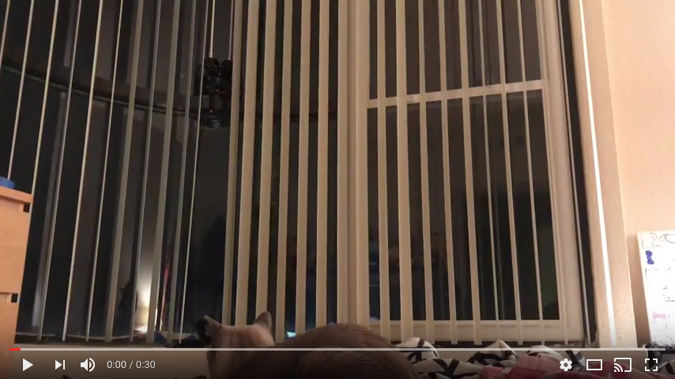
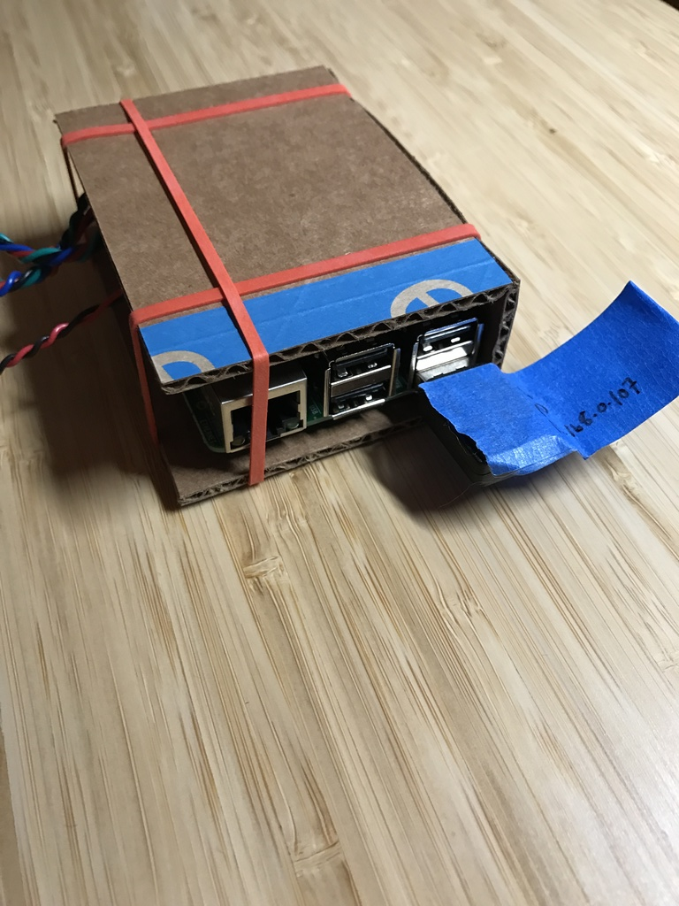
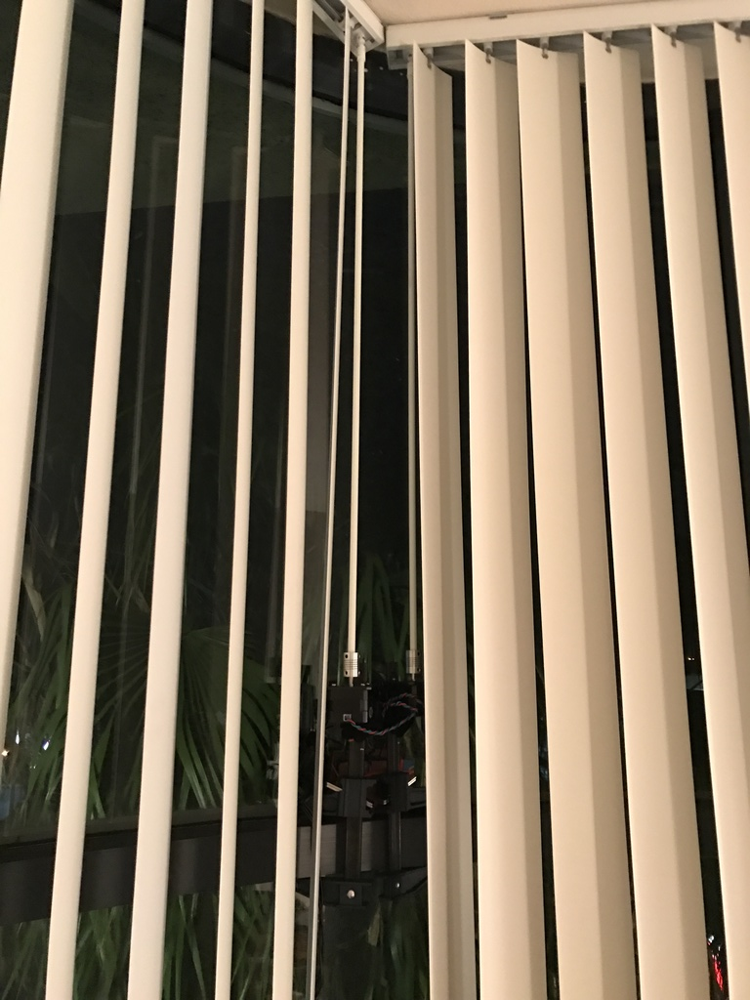

Automated blind control via an Amazon Echo Dot and Raspberry Pi

## Videos

Opening
{:width="768px"}

Closing
{:width="768px"}

## Build

Shameless Amazon Associates BOM
*   [Amazon Echo Dot](https://www.amazon.com/gp/product/B01DFKC2SO/ref=as_li_qf_sp_asin_il_tl?ie=UTF8&tag=jwahawis-20&camp=1789&creative=9325&linkCode=as2&creativeASIN=B01DFKC2SO&linkId=8066284c29bcd47b07bf712aa5f31467)
*   [Raspberry Pi with accessories](https://www.amazon.com/gp/product/B01C6Q2GSY/ref=as_li_qf_sp_asin_il_tl?ie=UTF8&tag=jwahawis-20&camp=1789&creative=9325&linkCode=as2&creativeASIN=B01C6Q2GSY&linkId=6dcd7db5905d7f718fe61928d9391ecf)
*   [Adafruit Stepper Hat](https://www.amazon.com/gp/product/B00TIY5JM8/ref=as_li_qf_sp_asin_il_tl?ie=UTF8&tag=jwahawis-20&camp=1789&creative=9325&linkCode=as2&creativeASIN=B00TIY5JM8&linkId=ffca63697e4f9ccf353288e846d3f175)
*   [Nema 17 Stepper Motor .4A 12V](https://www.amazon.com/gp/product/B00PNEQ9T4/ref=as_li_tl?ie=UTF8&camp=1789&creative=9325&creativeASIN=B00PNEQ9T4&linkCode=as2&tag=jwahawis-20&linkId=deaf3b953c76bb2416aa1811060c300e)
*   [12V 1.5A Power Supply](https://www.amazon.com/gp/product/B01DUNY9D2/ref=as_li_qf_sp_asin_il_tl?ie=UTF8&tag=jwahawis-20&camp=1789&creative=9325&linkCode=as2&creativeASIN=B01DUNY9D2&linkId=3ace95080ff7b5d5f6eeab4c24a78248)
*   [5mm to 8mm Coupler](https://www.amazon.com/gp/product/B00KHTVOEU/ref=as_li_qf_sp_asin_il_tl?ie=UTF8&tag=jwahawis-20&camp=1789&creative=9325&linkCode=as2&creativeASIN=B00KHTVOEU&linkId=29201451fd4e78abd9a09a8c8c41c42f)
*   [Mounting Bracket](https://www.amazon.com/gp/product/B01HHPD7LY/ref=as_li_qf_sp_asin_il_tl?ie=UTF8&tag=jwahawis-20&camp=1789&creative=9325&linkCode=as2&creativeASIN=B01HHPD7LY&linkId=49983742adc85960077c9a8a90a3d6e6)
*   [6" Bar Clamps](https://www.amazon.com/gp/product/B0000CCXVF/ref=as_li_qf_sp_asin_il_tl?ie=UTF8&tag=jwahawis-20&camp=1789&creative=9325&linkCode=as2&creativeASIN=B0000CCXVF&linkId=cb3802da6ccd80423604759d4878cb0b)

My apartment has large windows that are great during the day, but get a lot of light pollution at night. I've been wanting to automate the blinds given the advent of Siri and Alexa, but have hesitated assuming I would need to machine or fabricate _something_. That was until I discovered Amazon literally sells [every](https://www.amazon.com/gp/product/B010MZ8SQU/ref=as_li_qf_sp_asin_il_tl?ie=UTF8&tag=jwahawis-20&camp=1789&creative=9325&linkCode=as2&creativeASIN=B010MZ8SQU&linkId=1000de7377d9110fe24d93d647a139b6) [coupler](https://www.amazon.com/gp/product/B00DCAIRIC/ref=as_li_qf_sp_asin_il_tl?ie=UTF8&tag=jwahawis-20&camp=1789&creative=9325&linkCode=as2&creativeASIN=B00DCAIRIC&linkId=f42e90a307e7c301764135e5522e3a88) [imagineable](https://www.amazon.com/gp/product/B00KHTVOEU/ref=as_li_qf_sp_asin_il_tl?ie=UTF8&tag=jwahawis-20&camp=1789&creative=9325&linkCode=as2&creativeASIN=B00KHTVOEU&linkId=863f0c0e23c7aef7aab1de1188a792b1). 

I ended up automating through Alexa as it is already so well supported. I was up and running in under an hour by simply combining [fauxmo](https://pypi.python.org/pypi/fauxmo/0.3.2) with [Adafruit's motor drivers](https://github.com/adafruit/Adafruit-Motor-HAT-Python-Library/tree/master/Adafruit_MotorHAT).

The motors run a bit slow, but anything beyond 1/4 microstepping was unbearably loud. 

{:width="768px"}

{:width="768px"}

{:width="768px"}

{:width="768px"}

{:width="768px"}

{:width="768px"}

{:width="768px"}

{:width="768px"}

