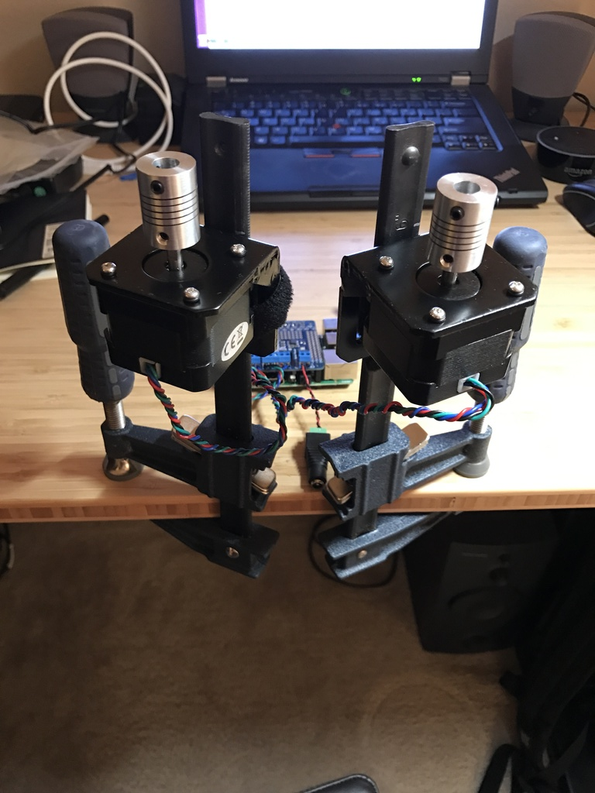

Automated blind control via an Amazon Echo Dot and Raspberry Pi

## Videos

{:width="768px"}

{:width="768px"}

## Build

{:width="768px"}

{:width="768px"}

{:width="768px"}

{:width="768px"}

{:width="768px"}

{:width="768px"}

{:width="768px"}

{:width="768px"}

